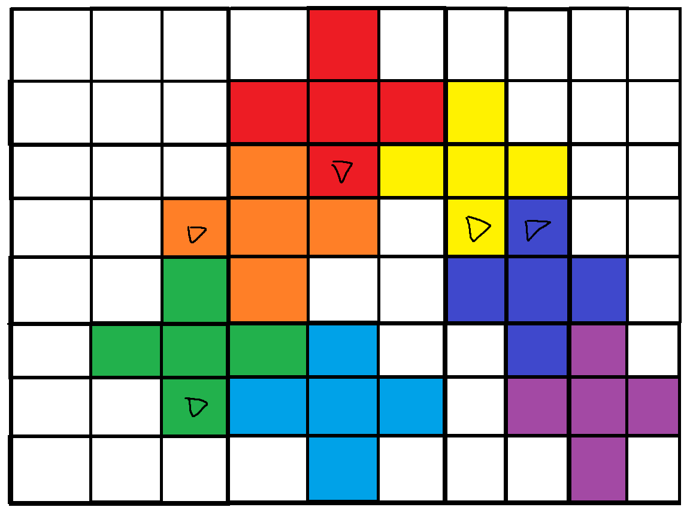
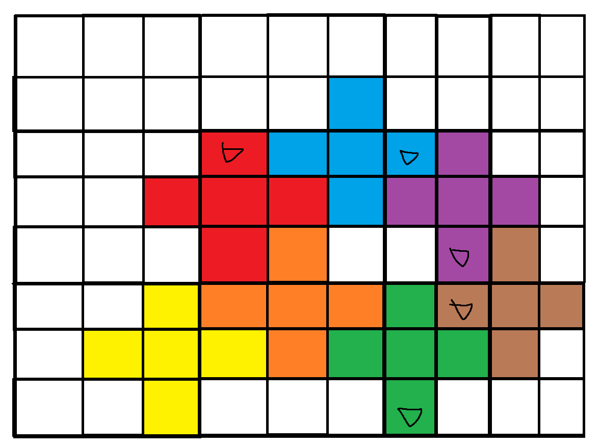

### 1. 마법의 숲 탐색
https://www.codetree.ai/training-field/frequent-problems/problems/magical-forest-exploration/description?page=1&pageSize=5


포인트 1. 구현
    보드의 깊이가 깊지 않으므로 한 칸씩 확인하며 이동한다.
    골렘의 높이가 3칸이기 때문에 위로 3칸까지의 여백을 준다.


포인트 2. 최대 깊이 탐색
    골렘의 수가 적기 때문에 완전 탐색으로 모두 방문하면 된다.
    완전 탐색을 위해서, 골렘간의 연결관계를 저장해야한다.
    이를 위해서 출구와 인접한 위치를 저장해둔다.

    처음 시도 방법 - union-find
    잘못된 이유 - 1->2->3, 1->4으로 연결된 경우 3과 4의 최대깊이가 똑같아 짐
     union-find에서는 노란 골렘도 파란색까지 갈 수 있게 된다.
    두번째 시도 방법 - 새 골렘이 추가되면 최대 깊이를 저장해두었다가 사용하는 방법
    잘못된 이유 - 이후에 추가된 골렘으로 인해 기존 골렘도 더 깊이 갈 수 있게 될 수도 있다.
     파란색이 추가되기 전에는 빨간골렘은 다른 곳으로 갈 수 없다.

```python
R, C, K = map(int,input().split())

# 오른쪽으로 이동시 방향 += 1
# 왼쪽으로  이동시 방향 -= 1
# 골렘이 연결되면 union해주면 중복 계산을 피할 수 있다.
# 공백은 0, 벽은 10000, 골렘 입구는 골렘 번호로 주자
rst = 0

def gol_cell(r,c):
    return [(r,c),(r-1,c),(r+1,c),(r,c-1),(r,c+1)]

def adj_cell(r,c):
    return [(r+1,c-2),(r+2,c-1),(r-1,c-1),
    (r,c-2),(r+1,c-1),(r+2,c),(r+1,c+1),
    (r,c+2),(r-1,c+1),(r+2,c+1),(r+1,c+2)]

def adj_map(r,c):
    return [
        Map[nr][nc] for nr,nc in adj_cell(r,c)]

def move(r,c,t): # 현재 중심 위치, 출구방향
    adj = adj_map(r,c)
    if not sum(adj[4:7]):
        return r+1,c, t
    elif not sum(adj[:5]):
        return r+1, c-1, t-1
    elif not sum(adj[6:]):
        return r+1,c+1, t+1
    else:
        return r,c,t # 안움직임

# 맵은 벽을 두 칸을 준다. ( 최대 2칸까지 확인하기 때문 )
# 0 0 1 1
# 1 1 1 1 
# 1 1 1 1 
# 인풋으로 받는 컬럼은 1을 빼고 사용한다.
# 시작하는 행은 -1에서 시작한다.
# 도착했을 때 행의 번호가 0 또는 -1이면 맵을 비운다.

MAX_depth = [0]*(K+1)


org_Map = [[0]*C+[10000,10000] for _ in range(R+1)]
org_Map.append( [10000]*(C+2))
org_Map.append( [10000]*(C+2))
org_Map.append([0]*C+[10000,10000])
org_Map.append([0]*C+[10000,10000])
org_Map.append([0]*C+[10000,10000])
Map = [i.copy() for i in org_Map]
connect = [set() for _ in range(K+1)]
# 최대한 이동
# 인접 골렘 union
# 최대깊이
for gol_num in range(1,1+K):

    c,v = map(int,input().split())
    c -= 1
    r = -2
    nr, nc, nv = move(r,c,v)

    while (r,c,v) != (nr,nc,nv):
        r,c,v = nr,nc,nv
        nr,nc,nv = move(r,c,v)


    MAX_depth[gol_num] = r+1
    if r<2:
        Map = [i.copy() for i in org_Map]
        continue

    for gr, gc in gol_cell(r,c):
        Map[gr][gc] = gol_num
    adj = adj_cell(r,c)
    if v%4 == 0:
        adj = [(r-1,c-1),(r-2,c),(r-1,c+1)]
    elif v%4== 1:
        adj = adj[6:9]
    elif v%4== 2:
        adj = adj[4:7]
    elif v%4== 3:
        adj = adj[2:5]
        
    connect[gol_num] = adj

    V = {gol_num}
    stk = [gol_num]
    tmp = r+1
    while stk:
        cur = stk.pop()
        for nr, nc in connect[cur]:
            nxt = Map[nr][nc]
            if 0<nxt<10000 and nxt not in V:
                tmp = max(tmp, MAX_depth[nxt])
                V.add(nxt)
                stk.append(nxt)
    rst += tmp

print(rst)
```